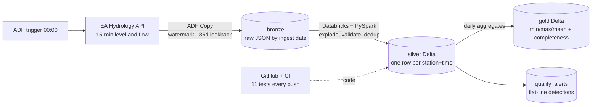
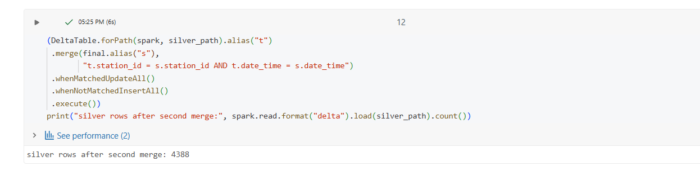
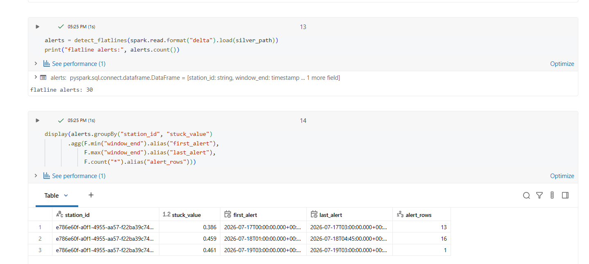
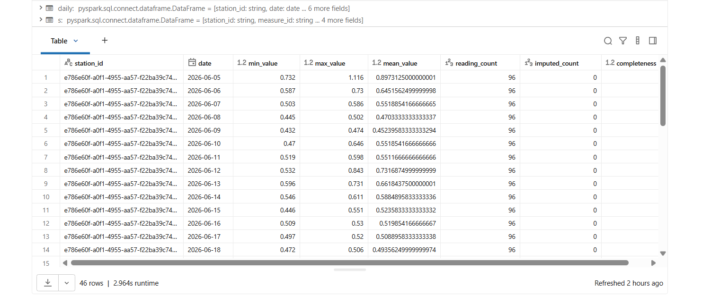

# Environment Agency Hydrology ETL Pipeline

**A production-grade, self-running data pipeline** that ingests river monitoring data
from the UK Environment Agency's Hydrology API into a medallion lakehouse on Azure —
nightly, incrementally, idempotently, with automated testing, quality monitoring and
alerting.

Built around a real engineering use case: the level and flow history a consultant needs
to design a bridge crossing of the **River Tyne**, referenced to the **Bywell** gauge
(recording since 1956, catchment 2,175 km²).

---

## Architecture



**Stack:** Azure Data Factory (ingestion, orchestration) · ADLS Gen2 (lake) ·
Databricks serverless + PySpark + Delta Lake (transformation) · Unity Catalog
(governed, keyless storage access via managed identity) · GitHub Actions (CI).

---

## The source drove the design

This architecture was derived from the API's **measured behaviour**, not a template.
Profiling the source revealed four properties that each forced a design decision:

| Discovery | Design consequence |
|---|---|
| Readings publish in **daily batches**, not real time | Daily batch at 00:00 — matched to the source's cadence, not polled |
| The source **revises data**: readings publish `Unchecked`, then re-publish after QA as `Good`/`Estimated`/`Suspect`, sometimes with corrected values | Loads are **Delta MERGE upserts** on `station_id + date_time`, never appends; the EA's quality flag travels to silver so consumers can filter |
| Qualified **flow lags level by weeks** (flow is rating-curve-derived and QA'd) | Ingestion uses a **35-day lookback** below the watermark, sized to the measured revision lag, so late-published data is re-fetched and upserted |
| Station GUIDs **contain hyphens** | Station keys are extracted with a pattern anchored on the measure suffix, not split at the first hyphen — with a test that reproduces the case |

---

## How a nightly run works

1. **00:00 — ADF trigger fires.** A Lookup reads `meta/watermark.json` — the latest
   timestamp successfully processed.
2. **Copy activity** calls the API for readings since `watermark − 35 days` and lands
   the response **byte-for-byte as raw JSON** in `bronze/readings/ingest_date=<run>/`.
   Bronze is Hive-partitioned: Spark reads it with partition pruning and gets
   `ingest_date` as a free lineage column.
3. **Transformation (Databricks, PySpark)** reads only the run's partition:
   explode → derive station key → enforce schema → **quarantine** invalid rows (never
   silently drop) → **deduplicate** preferring the most recent ingest (revisions
   supersede originals) → interpolate short gaps (≤ 1 hour), every imputed value
   flagged `is_imputed`.
4. **MERGE into silver** on `station_id + date_time` — matched rows update, new rows
   insert. One operation absorbs revisions, absorbs the lookback overlap, and makes
   re-runs safe.
5. **Quality checks:** a flat-line detector scans for values unchanged across a
   six-hour window — the failure mode volume alerts cannot see.
6. **Gold** aggregates daily min / max / mean per station, plus `imputed_count` and
   `completeness` (readings ÷ expected 96).
7. **Watermark advances** — only after success, derived from the **data** (max
   timestamp stored), never the clock.
8. Failures trigger an **Azure Monitor email alert**; the watermark stays put, so the
   next run self-heals.

The transform receives its partition date **as a parameter from the orchestrator**,
using the same expression that stamped the folder on write — writer and reader cannot
disagree. (This replaced clock re-derivation after a real timezone mismatch: the
trigger fires in UK local time while folders are stamped in UTC, which differ during
British Summer Time.)

---

## Verified, not assumed

| Property | Evidence |
|---|---|
| **Idempotency** | Merged the identical batch twice: silver at **4,371 rows both times** |
| **Dedup under overlap** | Overlapping load windows doubled several days; dedup collapsed **5,314 → 4,371** |
| **Completeness honesty** | Gold reports **1.0** on clean days, **0.979–0.99** where telemetry dropped — gaps surfaced, never hidden |
| **Flat-line detection, live** | First run against production data fired **30 alerts = 3 real episodes** (stuck values 0.386 / 0.459 / 0.461 m) — genuine low-summer-flow behaviour below gauge resolution |
| **Logic correctness** | **11 pytest tests** covering casting, quarantine, dedup preference, interpolation bounds, flat-line windows — run by CI on every push; red blocks merge |

The transformation layer is **pure functions** (`src/transforms.py`) — tables in,
tables out, no I/O — which is what makes it testable in CI with zero cloud dependency.

---

## Data honesty principles

- **Quarantine over deletion** — invalid rows are diverted and countable, never
  silently dropped.
- **Flag every estimate** — imputed values carry `is_imputed`; the EA's `quality`
  verdict travels to silver. Consumers can restrict to measured-and-verified data
  (flood statistics on `Good` only) or use everything, knowingly.
- **Interpolation capped at 1 hour** — a straight line between close neighbours is an
  honest claim about a continuous river; across six hours it could draw calm water
  through a storm. Longer gaps stay null and surface via completeness.
- **A visible hole beats a manufactured number** — flood analysis rests on annual
  maxima; an invented value at a storm peak corrupts the one number a bridge design
  depends on.

---

## Repository layout

```
├── src/transforms.py        # pure PySpark transformation logic (the tested core)
├── tests/                   # 11 pytest tests — the executable specification
├── .github/workflows/ci.yml # CI: fresh machine, PySpark, full suite on every push
├── notebooks/               # Databricks notebooks (bronze → silver → gold)
├── adf/                     # Data Factory pipeline definitions
├── docs/                    # evidence screenshots
└── v1/                      # the original proof-of-concept (kept deliberately)
```

**Why `v1/` is still here:** it's the spike — single scripts and a local database,
built to understand the source. Once the source's real behaviour was understood, the
project was rebuilt production-grade. The progression from prototype to production
system *is* the story.

---

## Incidents & lessons (kept on purpose)

- **Green ≠ right.** An early copy configuration ran green while silently writing
  **1 row from 347 KB** of input — the array wasn't being unfolded. Throughput numbers
  caught what the status colour didn't. Fix: land raw JSON, parse in Spark where it's
  code. *Verify with numbers, not colours.*
- **Alert storms.** The flat-line detector fires once per 15-minute window while
  flatness persists — a 9-hour episode produced 13 alerts. Correct detection, wrong
  granularity; episode-grouping is the refinement.
- **The timezone seam.** The first automated run stamped its folder with the previous
  day's date (local-time trigger, UTC-stamped folder). The tempting fix — shift the
  schedule an hour — breaks at the October clock change. The structural fix: pass the
  partition date from the orchestrator, removing the clock dependency entirely.

---

## Backlog (deliberate, ordered)

1. ForEach scale-out over a config-driven station list (pipeline already parameterised)
2. Per-measure watermarks (level and flow publish at different speeds)
3. Episode-grouping for flat-line alerts; route quality failures into the alert channel
4. Materialise the expected 15-minute grid so structural gaps become visible nulls
5. Key Vault for the ADF storage key (Databricks already keyless via managed identity)
6. Dev/prod environments, IaC, expectations-style data tests, bronze retention

---

## Running it

**Azure:** resource group with ADLS Gen2 (`bronze/silver/gold/meta`), Data Factory
(pipeline in `adf/`), Databricks with Unity Catalog external locations per container.
**Locally:** `pip install -r requirements.txt` then `python -m pytest tests/ -v` —
the full transformation suite runs on any machine, no cloud required.

---


### Evidence

**Idempotency — the same batch merged twice, count unchanged:**


**Flat-line detector's first production findings — 30 alerts, 3 real episodes:**


**Gold layer — daily aggregates with the completeness metric:**



---

*Data: Environment Agency Hydrology API, © Crown copyright, Open Government Licence v3.0.*
